# Trabajo Practico 1 - Git Basico

## Creacion de repos 01

Clonar nuevo repo remoto

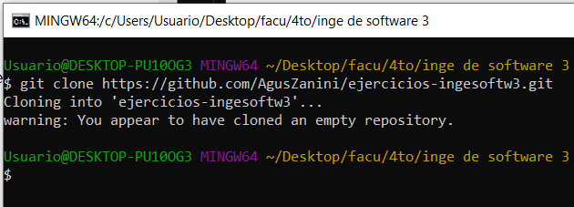

Editar README

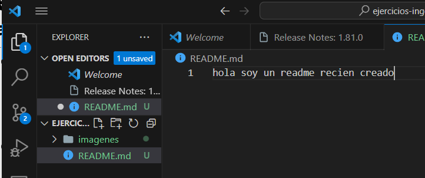

Crear .gitignore

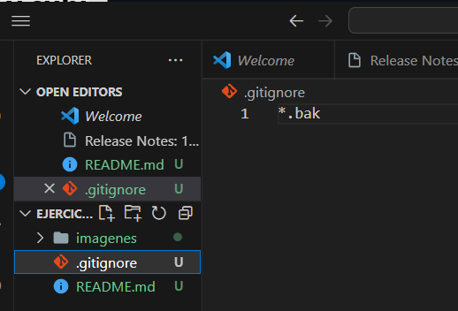

Primer commit

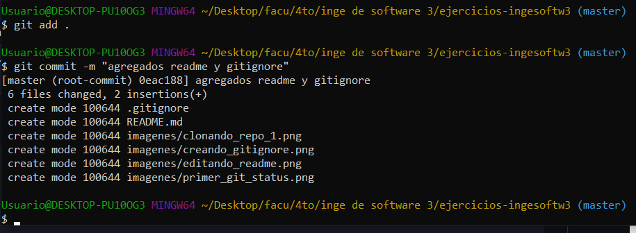

Primer push

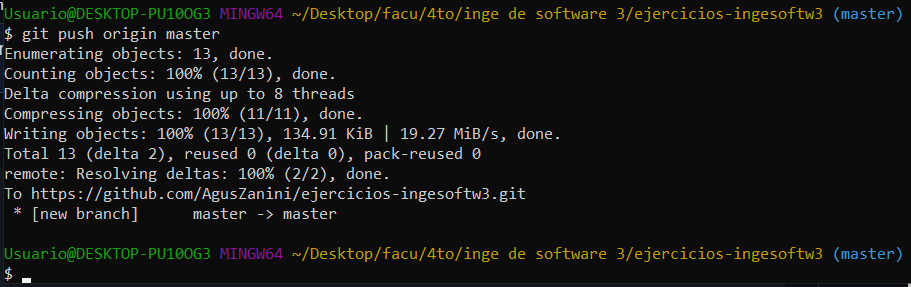

## Creacion de repos 02

Crear repo local

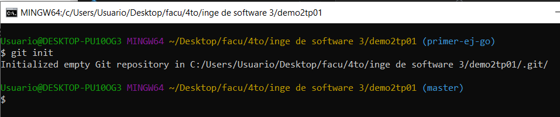

Crear repo remoto

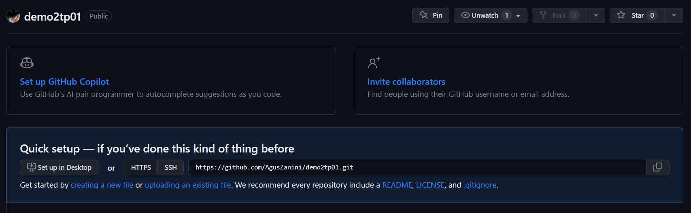

Asociar repo local con remoto

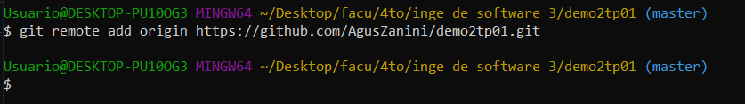

Commit 

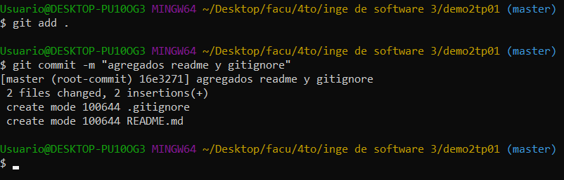

Push

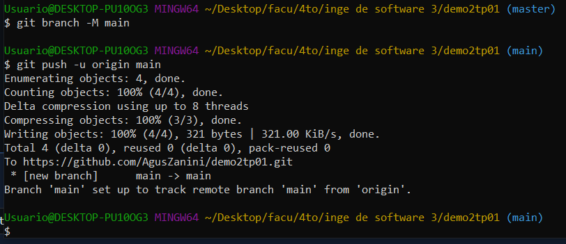

## Ramas

Nueva rama

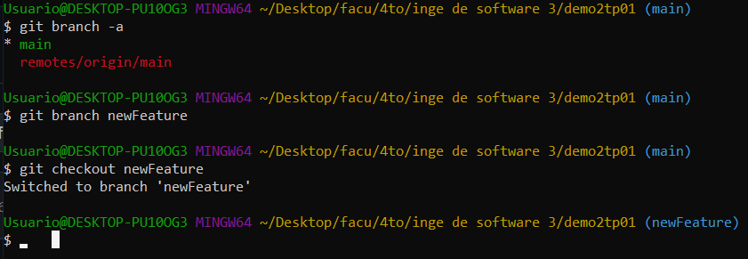

Cambio en nueva rama

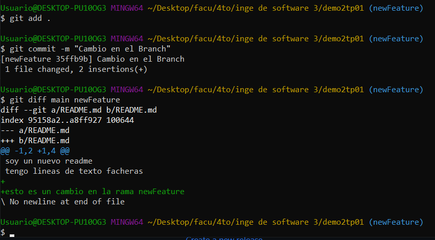

## Merges

Merge a rama creada

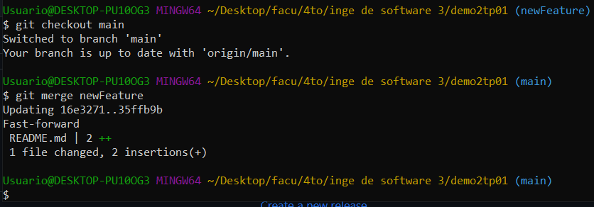

Push

Nueva rama

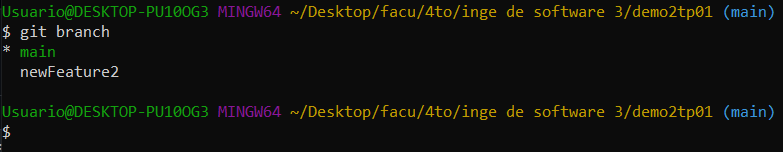

Cambio en nueva rama

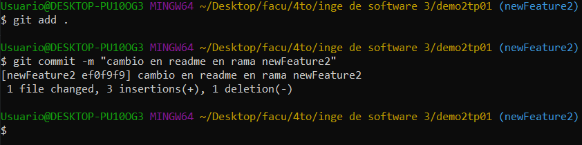

Cambio en rama main 

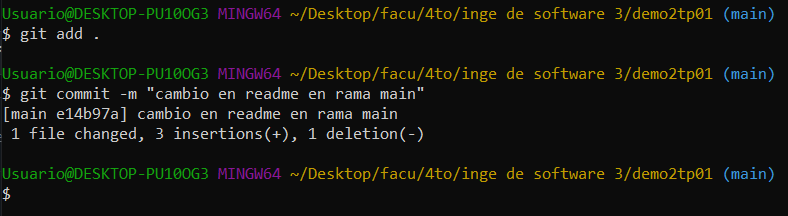

git diff

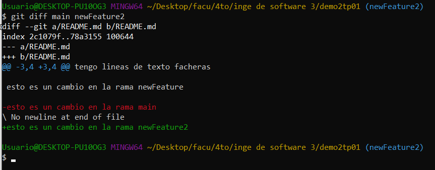

Conflicto en merge

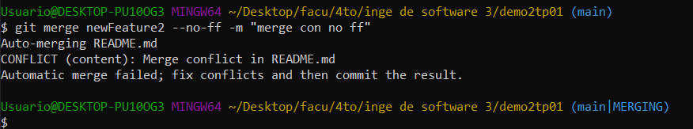

Visualizacion desde VSCode

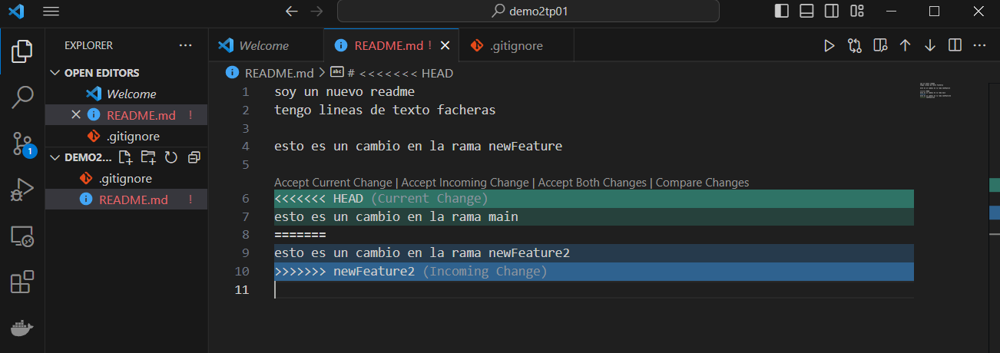

Resolviendo conflicto

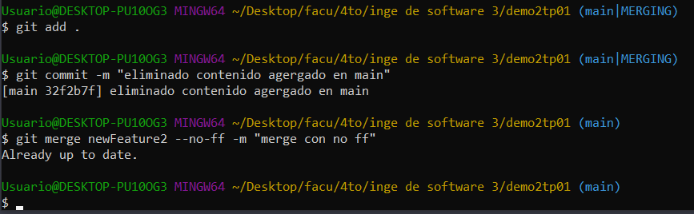

## Pull request

El pull request es una solicitud que envia un desarrollador a otro que tenga el poder de aceptar o no cambios en un proyecto, el desarrollador que evalua los cambios hace pull en caso de aceptarlos.

Agregando cambios a branch

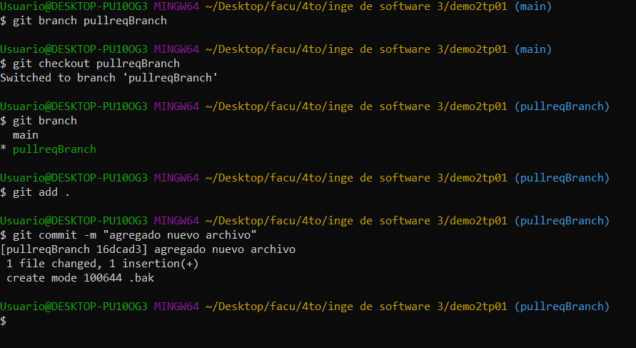

Push 

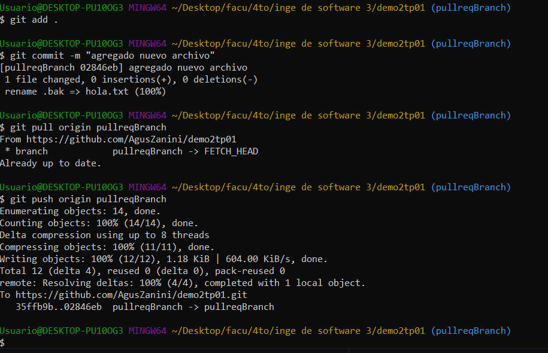

Pull request

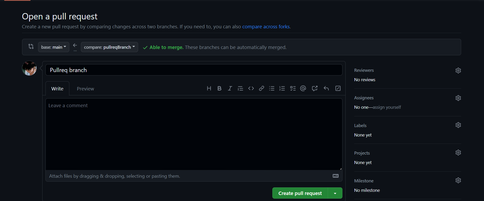

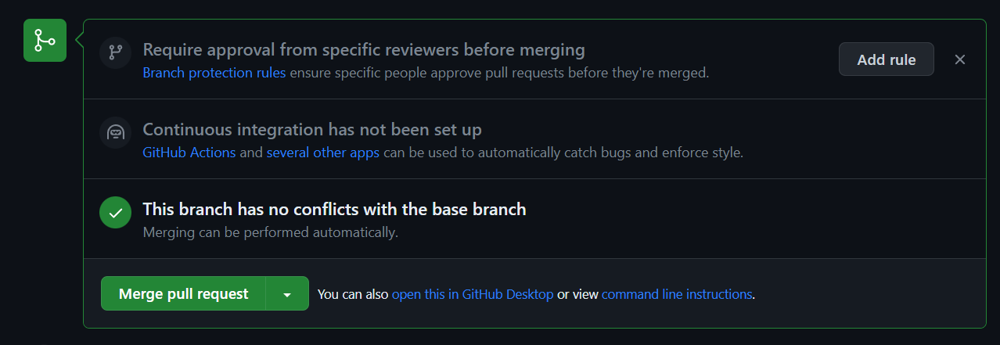

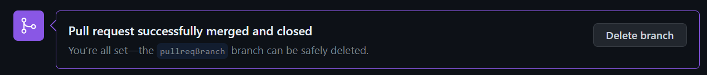

