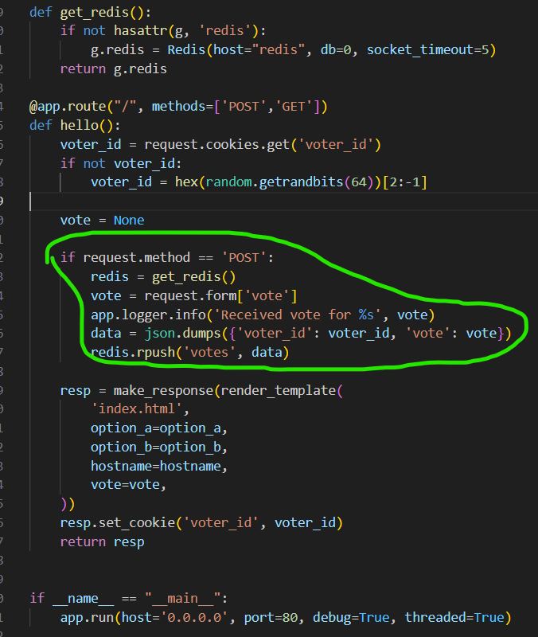
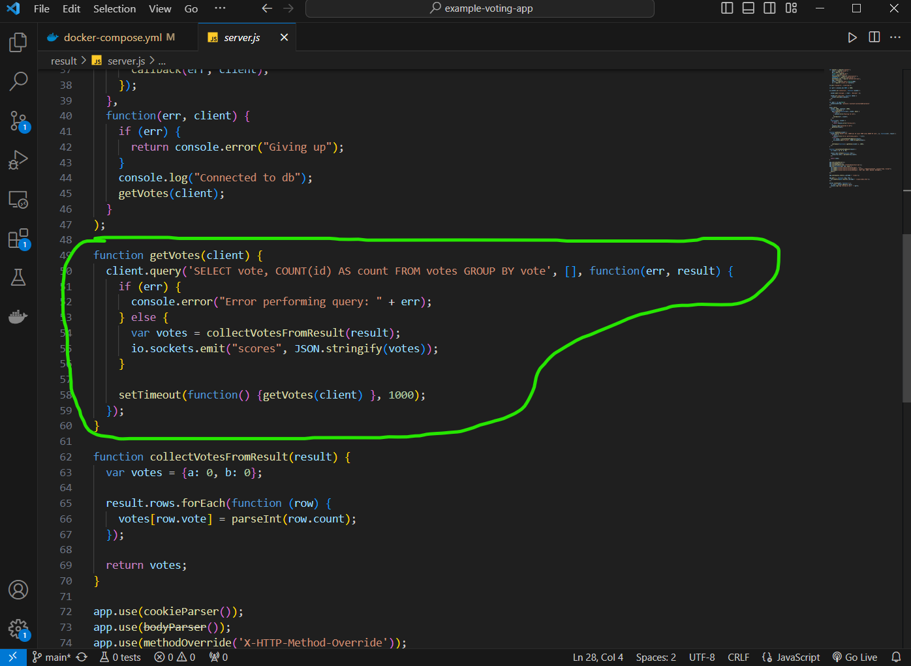

# Trabajo práctico número 3 - Arquitectura de Sistemas Distribuidos
---
## 1. Sistema distribuido simple

- Crear una red en docker

- Instanciar una base de datos redis conectada a esa red

- Levantar una aplicación web que use esa base de datos

- Abrir un navegador y acceder a la url

- Verificar el estado de los contenedores y redes en docker
    - Estado de los contenedores
      

    - Estado de las redes
      

    - Detalles de la red mybridge
      

    - Puertos abiertos:
        - 5000 para la aplicación web.
        - 6379 para redis.

    - Comandos utilizados:
        - `docker ps` para ver el estado de los contenedores y ver en que puertos están corriendo.
        - `docker network ls` para ver el listado de las redes que tengo.
        - `docker network inspect <nombre de la red>` para ver el detalle de la red mybridge.

## 2. Análisis del sistema

- Según el codigo dado lo que hace es:
    1. Crear una instancia de una aplicación Flask y guardarla en una variable `app`.
    2. Crear una conexión a una base de datos redis y guardarla en una variable `redis`.
    3. Obtener el valor de la variable de entorno `BIND_PORT` y guardarla en una variable `bind_port`.
    4. Con un decorador, asignar la ruta de destino a la función que se va a crear a continuación.
    5. Crear una función `hello()` que cada vez que se ejecuta incrementa en uno el valor de la clave `hits` de redis, luego trae el valor actual de dicha clave y lo devuele con un mensaje en un string.
    6. Si este script se ejecuta como programa principal, entonces se inicia la aplicación web con un host de `0.0.0.0` para que pueda ser accedida desde cualquier ip y se inicia en el puerto contenido en la variable `bind_port`

- Los parámetros `-e` están para poder asignarle valores a las variables de entorno de la imagen de docker.
- Si ejecutamos `docker rm -f web` vamos a eliminar el contenedor de la aplicación web, y si depués corremos el otro comando va a usar la imagen que ya tenemos descargada para crear un contenedor nuevo.
- Si borro el contenedor de redis, al cargar la pagina va a dar una excepción por error de conexión.
- Si levanto de nuevo el contenedor de redis, va a funcionar la pagina, pero voy a perder el recuento de visitas que llevaba.
- Para no perder el conteo de visitas podría hacer uso de un volumen para guardarlas por mas que se elimine el contenedor de redis.

## 3. Utilizando docker compose

- Al crear el docker-compose, y ejecutarlo con `docker-compose up -d` se va a correr el script que tenemos escrito en el archivo `docker-compose.yaml`, y lo que va a hacer es:
    - Crear 2 servicios (contenedores), uno llamado `app` que se creará a partir de la imagen de la aplicación web que usamos antes y otro llamado `db` que se creará a partir de ultima imagen de redis
    - Al servicio app, le asigna las variables de entorno correspondientes y el puerto 5000 tanto en el host como en el contenedor.
    - Al servicio db le crea un volumen para poder persistir los datos por mas que eliminemos el contenedor, se le asigna el volumen creado al servicio.

## 4. Aumentando la complejidad, analisis de otro sistema distribuido

- Emision de voto

- Resultado

### Configuración del sistema:

El sistema está compuesto por 6 servicios:
- vote: La aplicación de votación construida en python, expone el puerto 80 en su contenedor y se mapea con el puerto 5000 del host.
- result: Aplicación que muestra los resultados de la votación, expone el puerto 80, que se mapea con el 5001 del host, y el puerto 5858, que se mapea con el puerto 5858 del host.
- redis: una base de datos redis que usa un volumen para los healthchecks, expone el puerto 6379 y se mapea con el mismo puerto del host.
- db: una base de datos postgres que configura unas variables de entorno, expone el puerto 5432 y lo mapea con el mismo puerto en el host, usa un volumen para los datos y otro para los healthchecks
- worker: un worker que depende de que redis y db hayan pasado los healthchecks para inciarse
- seed: un servicio que no se levanta a menos que se especifique con un comando
Tiene una creación de un volumen llamado db-data, es el que usa el servicio db.
Tiene una creación de dos redes, una llamada front-tier, que la usan los servicios vote y result, y otra llamada back tier, usada por todos los servicios menos por seed

## 5. Análisis detallado

Exponer mas puertos

-
Se puede ver que se envian los votos a una cola de redis llamada `'votes'` de `app.py` con el metodo `rpush` del modulo de Redis

-
Dentro del worker se puede ver como se capturan los votos para luego actualizarlos por medio de una funcion auxiliar que realiza un `UPDATE` en la base de datos

-
- Se puede ver que en la funcion `getVotes` de `server.js` se realiza la consulta a la base de datos para traer los votos, luego se recolectan los votos desde los resultados de la consulta usando una funcion auxiliar y finalmente se emiten con sockets.

-
Explorar las tablas con dbeaver

-
En resumen, la aplicacion cuenta con diferentes partes, las cuales son:
* frontend
* vote service
* worker
* result service
* redis
* base de datos (postgresql)

Estas partes se comunican entre si de la forma indicada en el siguiente diagrama de secuencia:

