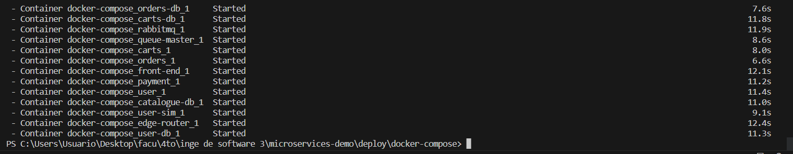
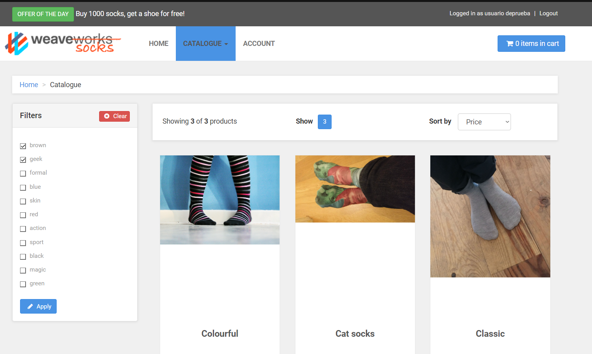
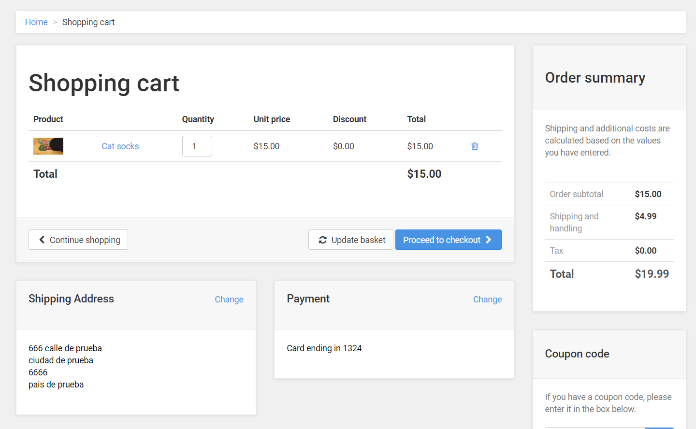

# Trabajo práctico 4 - Arquitectura de Microservicios
---
## 1. Instanciación del sistema

- Clonar el repositorio

- Ejecutar docker compose

- Generar un usuario

- Realizar busqueda 

- Realizar una compra 

