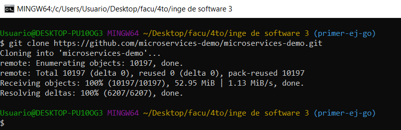
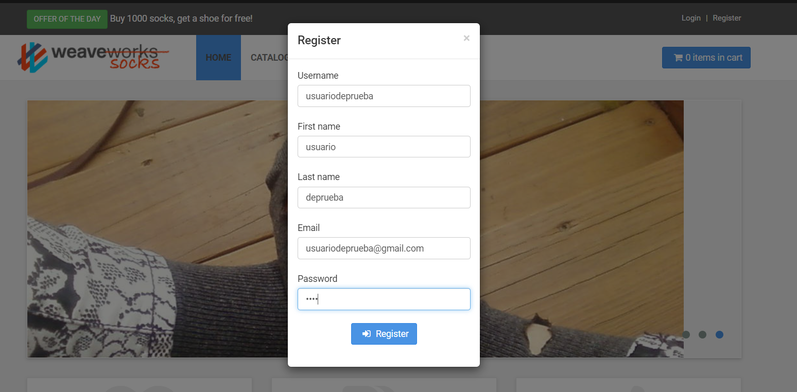
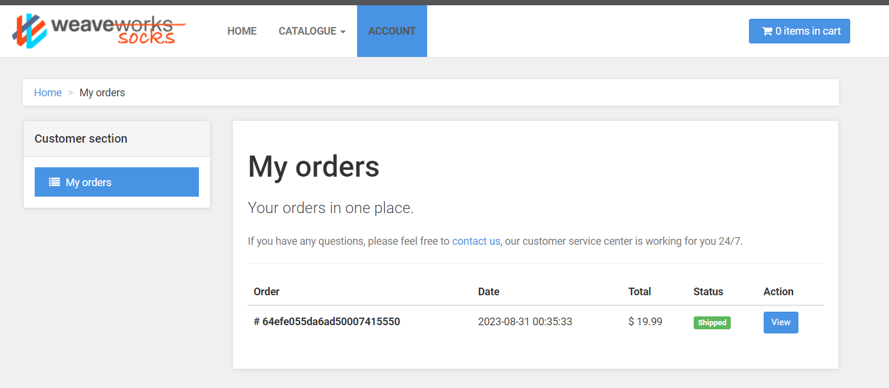

# Trabajo práctico 4 - Arquitectura de Microservicios
---
## 1. Instanciación del sistema

- Clonar el repositorio

- Ejecutar docker compose

- Generar un usuario

- Realizar busqueda 

- Realizar una compra 

## 2. Investigación de los componentes

1. Se crearon 15 contenedores, donde cada uno expone un servicio diferente:
    - Servicio de catálogo.
    - Base de datos Mysql para el catálogo.
    - Servicio de carritos.
    - Base de datos mongo para los carritos 
    - Servicio de ordenes
    - Base de datos mongo para las ordenes
    - Servicio de envíos.
    - Rabbit-mq que proporciona un servicio de colas de mensajes.
    - Consumidor de las colas rabbit llamado queue-master.
    - Servicio de pagos.
    - Servicio de Usuarios.
    - Base de datos mongo para los usuarios usuarios.
    - Servicio de load-tests.
    - Servicio de api gateway llamado edge-router.
    - Front-end.

2. Tener repositorios separados por cada servicio permite que estos estén desacoplados el uno del otro, que sean independientes, esto nos da la ventaja de que si algo falla no se cae todo el sistema, solo el servicio en el que ocurre la falla. Otra ventaja es la posibilidad de escalamiento horizontal que ofrece la arquitectura de microservicios, pudiendo generar varias instancias dinamicamente de los servicios que reciban la mayor carga. También nos da cierta abstracción al comunicar los servicios entre sí, no importa en que lenguaje estén escritos los servicios, solo la función que cumplan y el resultado que den. La principal desventaja es la complejidad que acarrean las arquitecturas de microservicios, necesitamos que los cambios que efectúe un servicio se vean reflejados en otro y que no se generen conflictos al intercatuar varios servicios sobre un mismo recurso.

4. El contenedor que funciona de Api Gateway es edge-router

8. Los datos se persisten por medio de las bases de datos que tiene cada servicio.

9. El componente encargado de procesar la cola de mensajes es el consumer llamado queue-master.

10. Los microservicios se comunican a través de RabbitMq