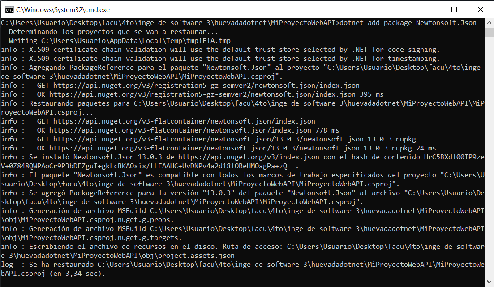

# Trabajoi Práctico 5 - Herramientas de construcción de software

## 1. Ejemplo en c# y .NET Core

- Ejecutar la aplicación.

- Entrar a la url con /weatherforecast

- project-assets.json

- Borrar bin y obj

- Agregar newton.json

- MiProyectoWebAPI.csproj

- project-assets.json con newton

- Borrar bin y obj nuevamente

- Contenido de net7.0 luego de ejecutar de nuevo la aplicación

## 2. Ejemplo con node.js

- Crear aplicación react

- npm start

- Manejo de paquetes de node

## 3. Ejemplo con python

No se pudo instalar make por una mala configuracion en msys2 que no se pudo resolver.

- `Cookiecutter` sirve para crear un proyecto nuevo preconstruido para poder seguir trabajando en el
- `make` sirve para la administracion y compilacion de proyectos
- `pip` sirve para gestionar modulos de python

## 3. Build tools para otros lenguajes

1. Java:
    - Apache Maven
    - Gradle
    - Ant
2. Python:
    - setuptools
    - pipenv
    - Poetry
3. Ruby:
    - RubyGems
    - Bundler
    - Rake
4. Go:
    - go build
    - go get
    - dep
5. Rust:
    - Cargo
    - Rustup
6. PHP:
    - Composer
    - Phing
7. C/C++:
    - Make
    - CMake
    - Ninja
8. Scala:
    - sbt (Scala Build Tool)
9. Perl:
    - CPAN
    - cpanm
10. Lua:
    - LuaRocks
