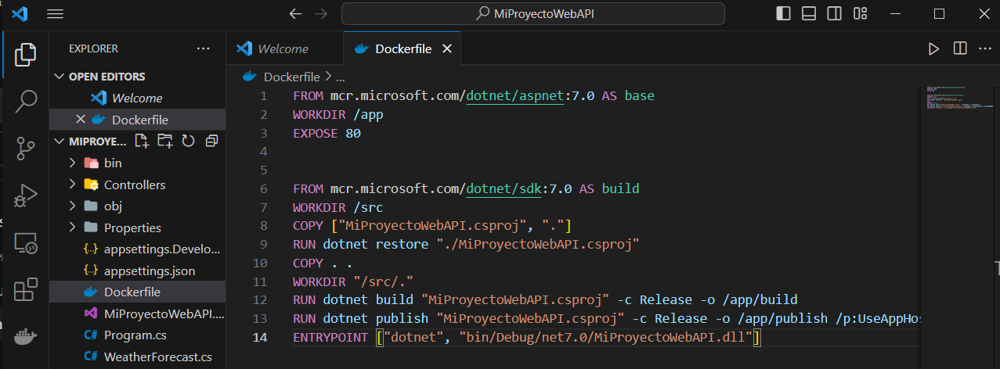
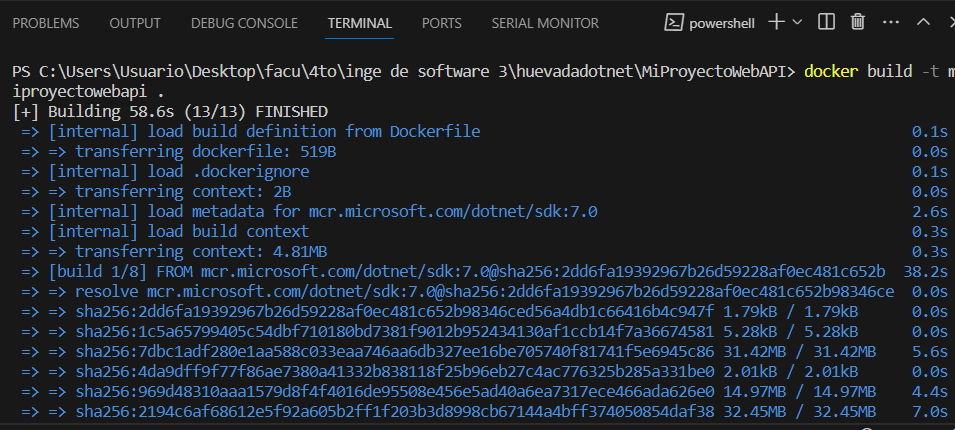
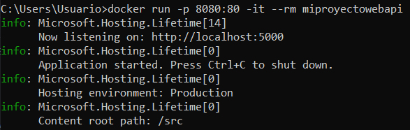
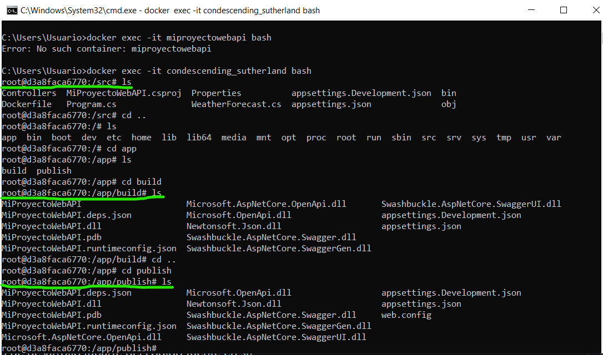
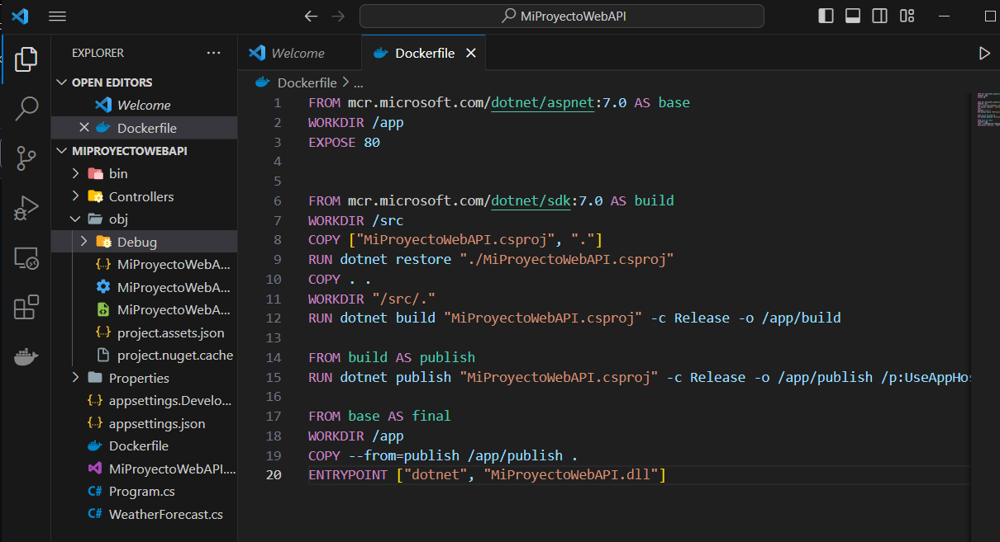
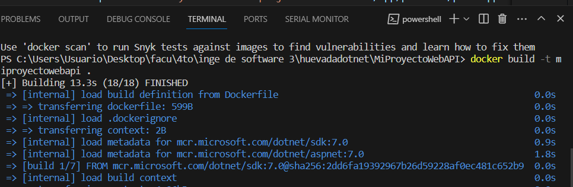
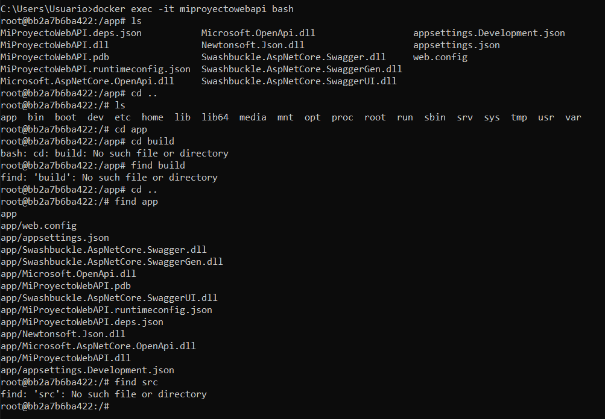
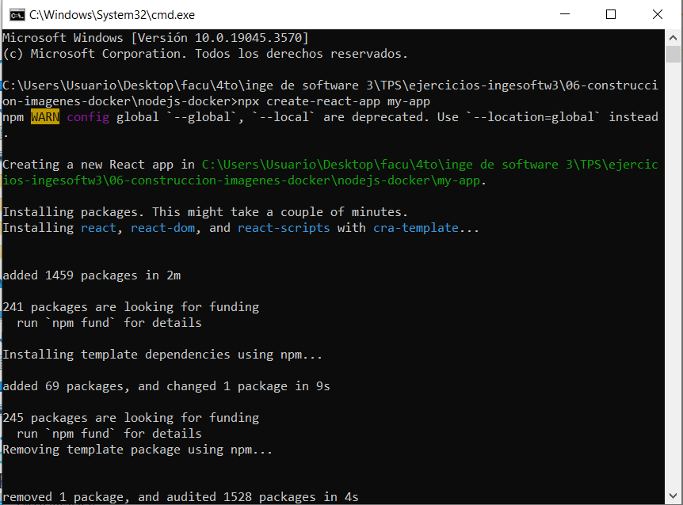

# Trabajo práctico Nro 6 - Construcción de imágenes de Docker

## 1. Describir las instrucciones de un Dockerfile

- FROM: Sirve para especificar la imagen base a partir de la que se va a construir una imagen de Docker.
- RUN: Sirve para ejecutar comandos dentro dle contenedor al momento de construir la imagen de Docker.
- ADD: Sirve para copiar archivos y directorios desde el host al contenedor con la posibilidad de extraer archivos comprimidos y urls remotas
- COPY: al igual que add, también sirve para copiar archivos y directorios desde el host al contenedor, pero con la diferencia de que se usa solo para copiar archivos locales al contenedor
- EXPOSE: Sirve para indicar que puertos exponer para comunicarse con el exterior del contenedor
- CMD: Sirve para agregar un comando predeterminado que se ejecutará cuando se inicie un contenedor basado en la imagen.
- ENTRYPOINT: Permite configurar un comando o una aplicación que se ejecutará siempre que se inicie un contenedor. La diferencia con CMD es que los argumentos especificados en CMD se pueden anular cuando se inicie el contenedor, mientras que los especificados en ENTRYPOINT no se pueden anular directamente, se deben proporcionar como argumentos adicionales cuando se inicia el contenedor.

## 2. Generar imagen de Docker

- Dockerfile

- Build

- Run

- Carpetas src, app/build y app/publish

## 3. Dockerfiles Multi Etapas

- Nuevo Dockerfile

- Build

El nuevo dockerfile tiene agregadas las instrucciones `FROM build AS publish` que crea una imagen llamada publish a partir de la imagen previamente creada llamada build y luego `FROM base AS final` que crea una imagen nueva a partir de la imagen base llamada final, por último la línea `COPY -- from=publish /app/publish .` copia el contenido de la carpeta /app/publish de la etapa publish para agregarlo al directorio de trabajo de la etapa final

- Carpetas

Se ve que no están las carpetas app/publish, app/build ni src, ya que fueron creadas en otra imagen que no fue la imagen final, el contenido de app/publish esta copiado en la carpeta app de la imagen final.

## 4. Imagen para aplicacion web Nodejs

Generar un proyecto node

