# Trabajo Practico 7 - Servidor de Build (de integracion continua)

# Desarrollo:

## Poniendo en funcionamiento Jenkins

Imagen de Docker basada en Jenkins

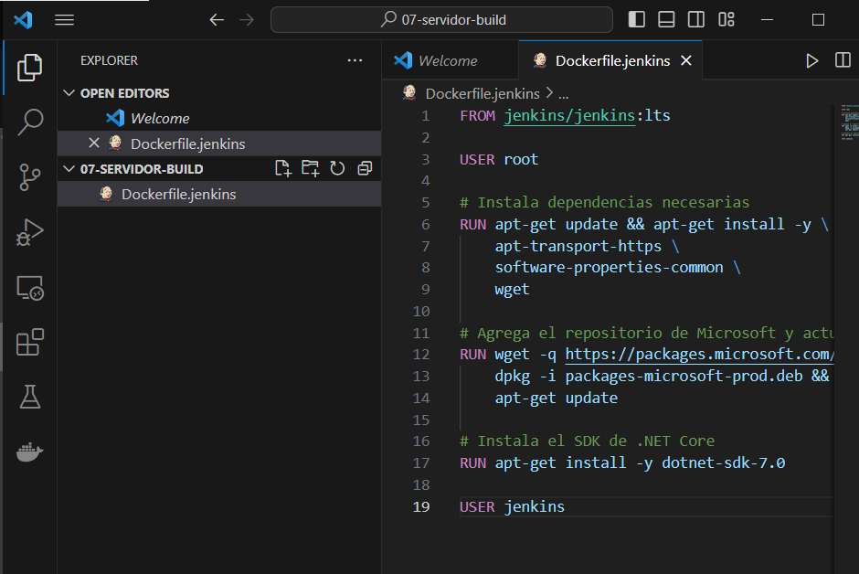

Construccion de imagen DOcker 

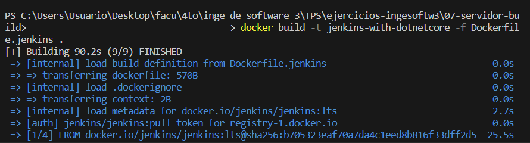

Contenedor corriendo

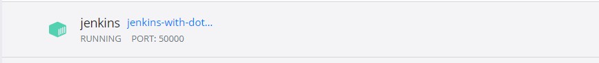

Contrasenia inicial de Admin

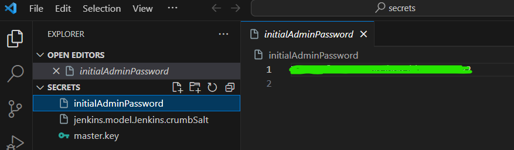

Entrando al cliente de Jenkins

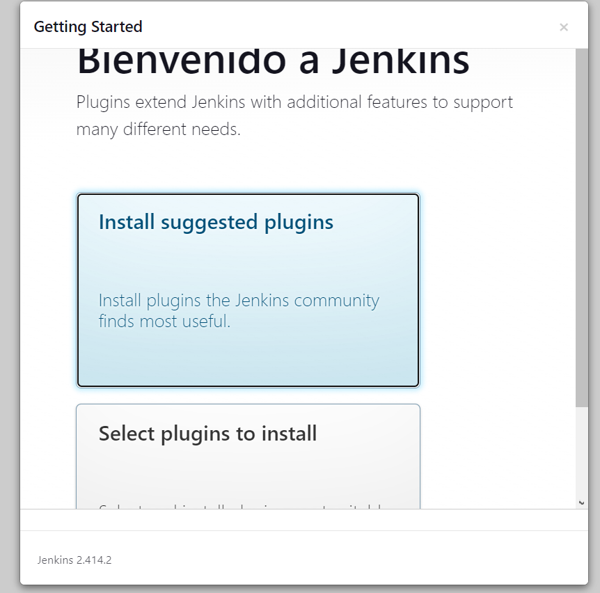

Plugins por defecto instalados y usuario creado

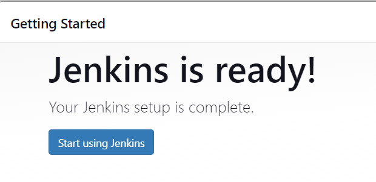

Administrar plugins

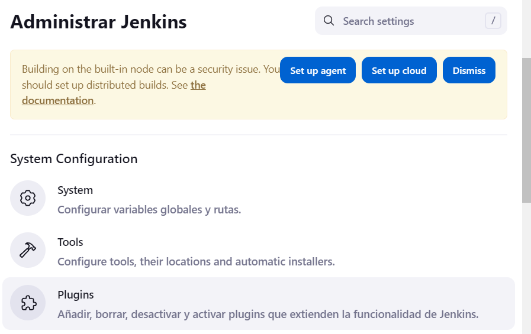

Plugin .NET SDK Support instalado

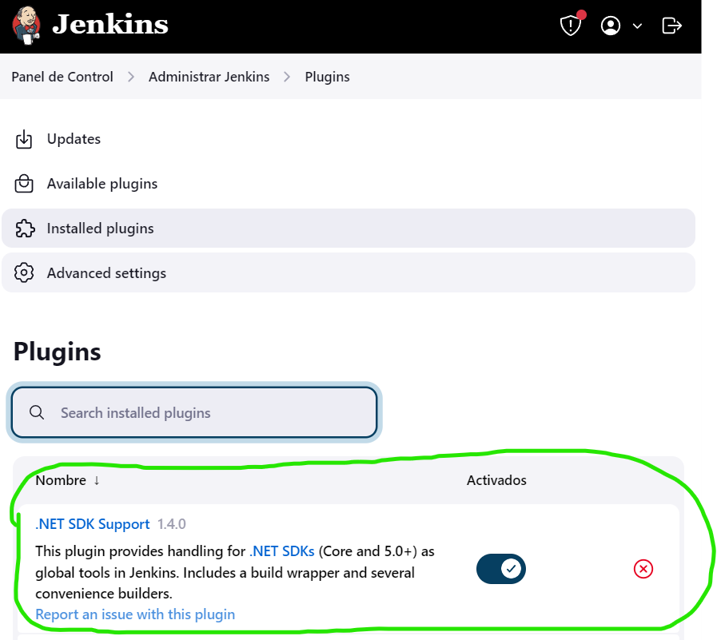

## Creacion de Jobs

Resultado del job de estilo libre

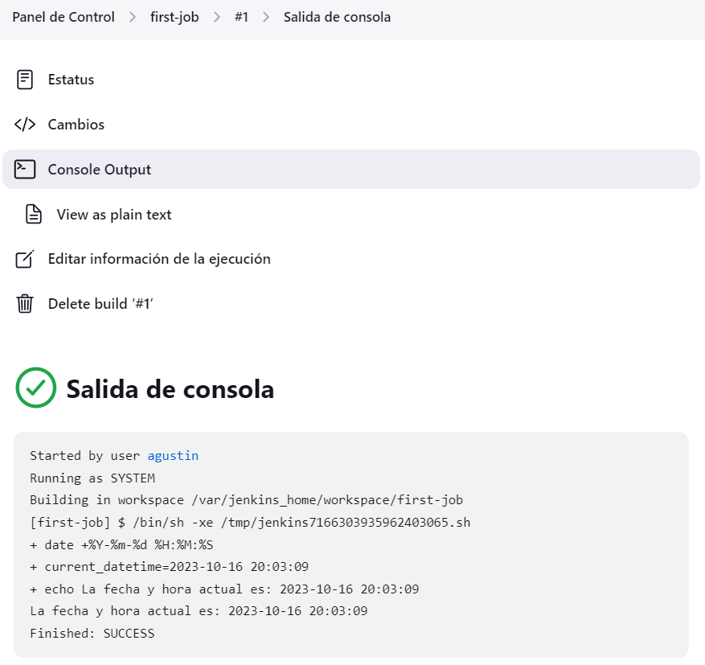

Sample pipeline

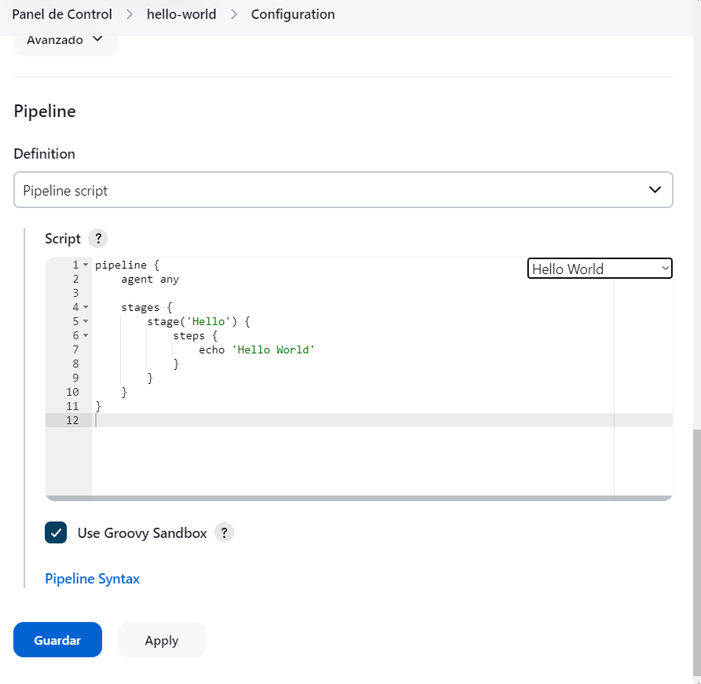

Hello world

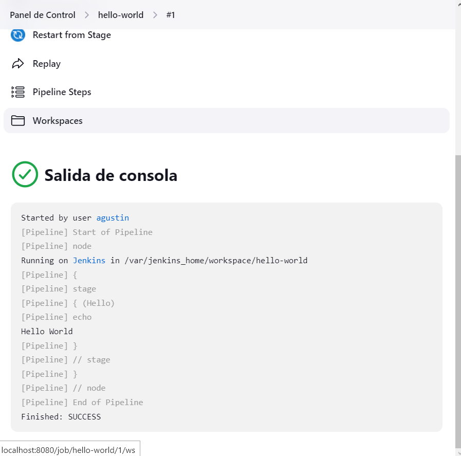

Resultado del github-job

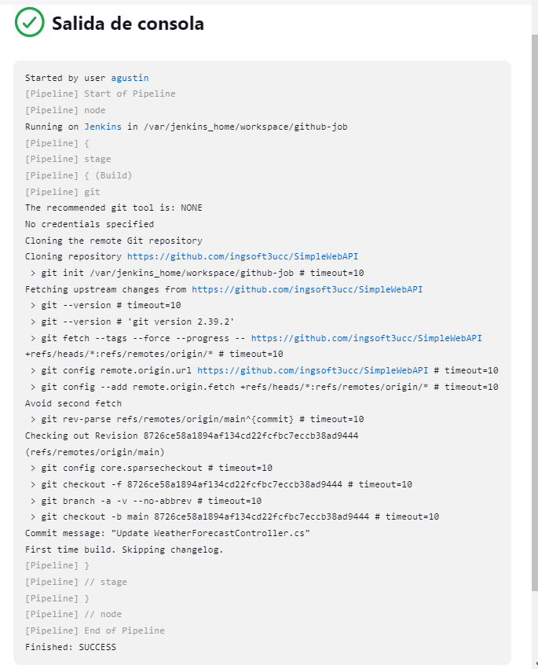

## Dotnet Job

Resultado del job que construye el proyecto .net del TP 05

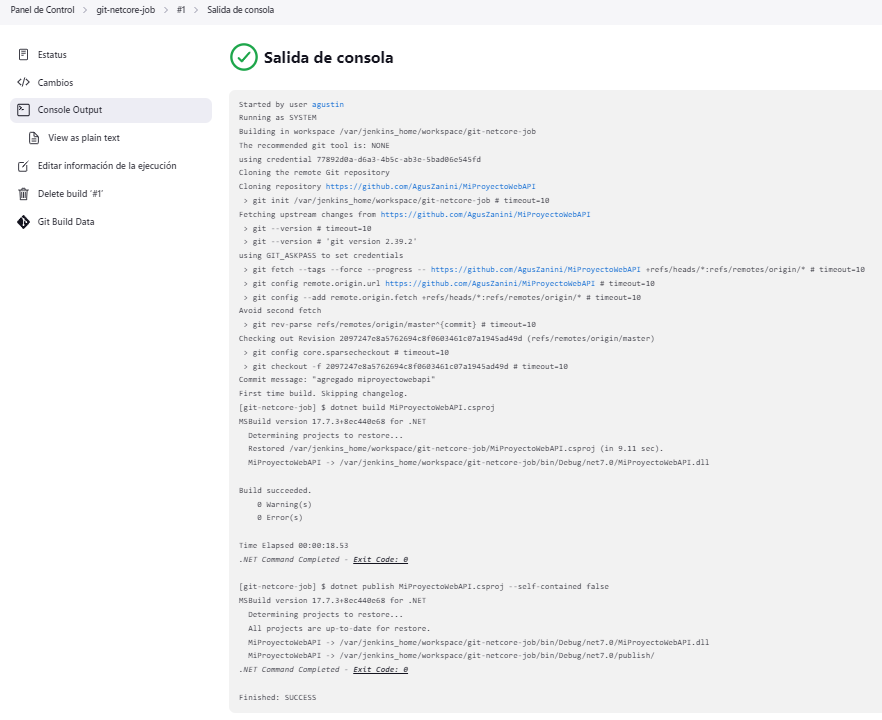

