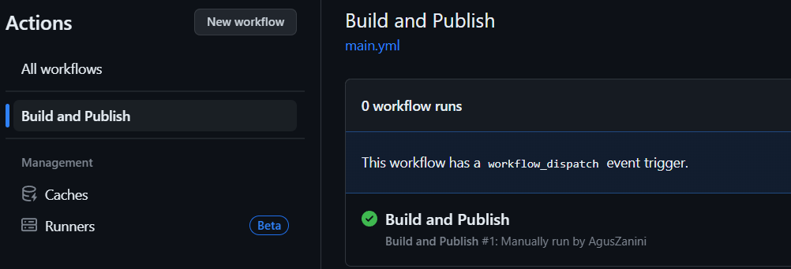

# Trabajo Practico 8 - Herramientas de construccion de software en la nube

Creacion de un nuevo workflow

Guardado del nuevo workflow

Ejecucion correcta

---
* El pipeline mostrado divide al workflow en dos etapas, `build` que se encarga de la construccion y `deploy` que se encarga del publicado del deployment del proyecto al servidor
---

## Github Actions para generar una imagen Docker de SimpleWebAPI

Secretos creados

Workflow guardado

Imagen publicada en Docker Hub

Se descarga y se corre la imagen

Visualizacion

## Github Actions para el proyecto de React

Archivo .yml

## Github Actions para generar una imagen Docker y subirla a Docker Hub

Archivo .yml

