# Trabajo Practico 9 - Pruebas Unitarias

Clonacion de repositorio

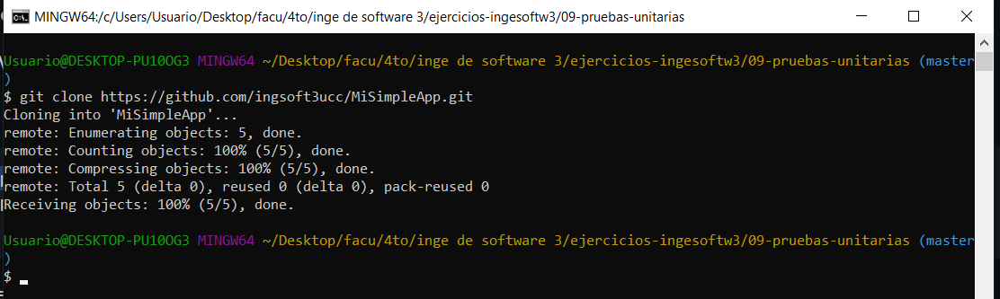

Revision de codigo

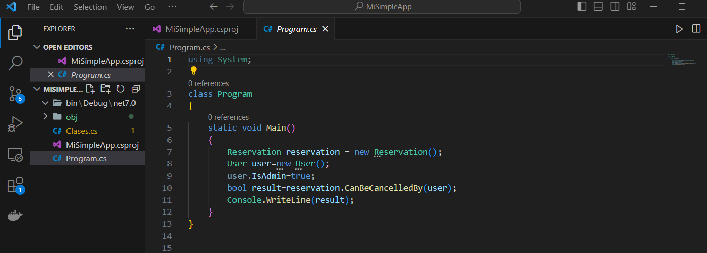

Creacion de simpleapptests

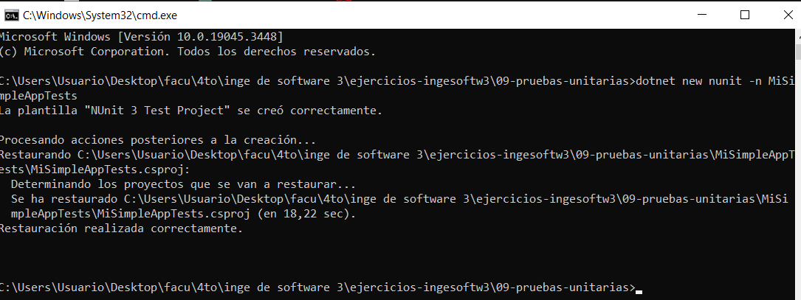

Agregamos paquetes

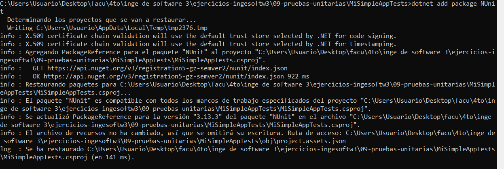

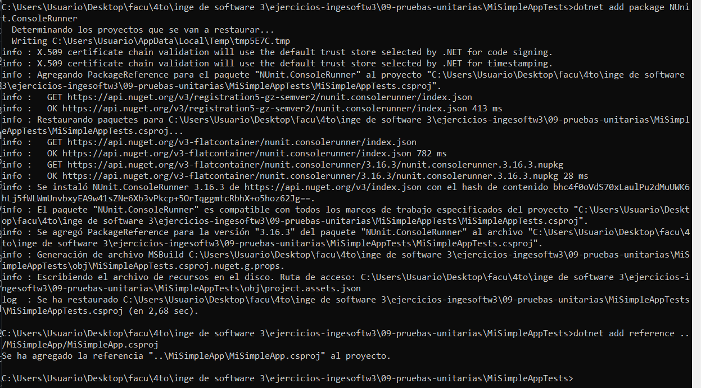

Instalacion de extension .NET Core Test Explorer

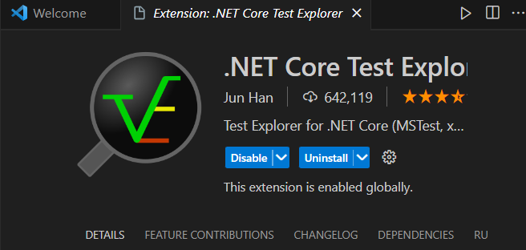

Edicion de settings.json

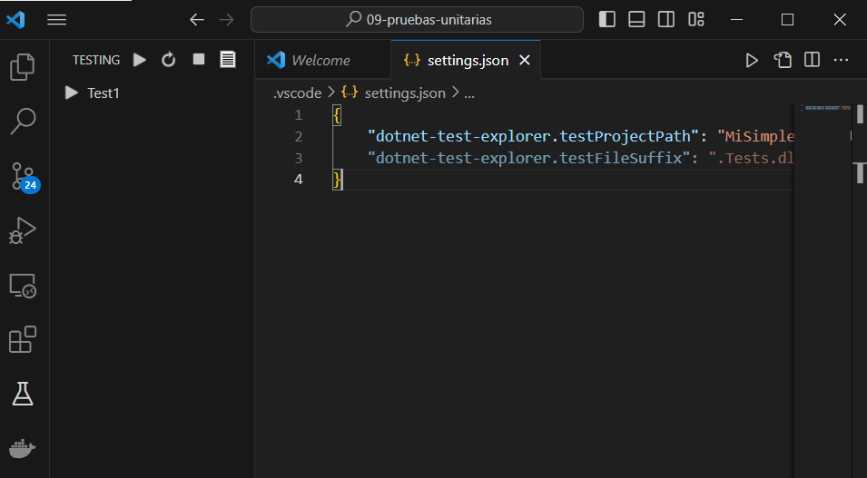

Run de tests

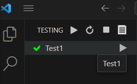

## Creacion de nuestros tests

Edicion de UnitTest1.cs

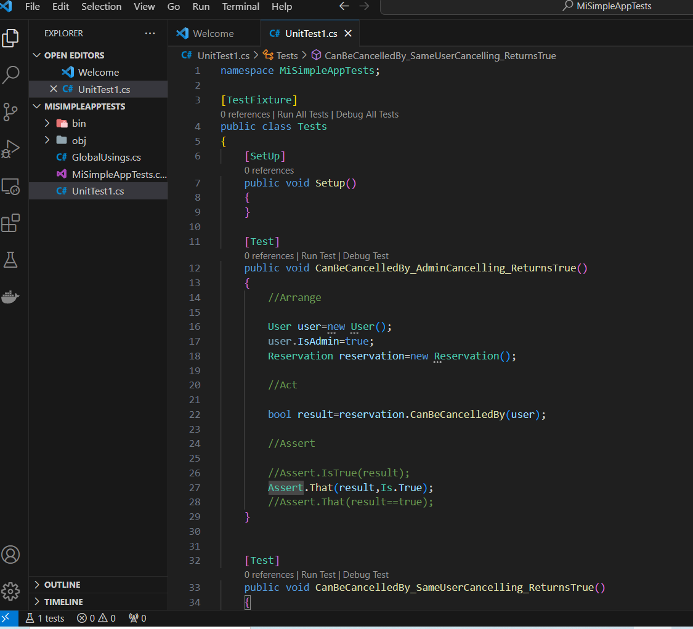

Run de los nuevos tests

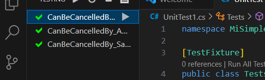

Edicion del codigo bajo prueba para que falle

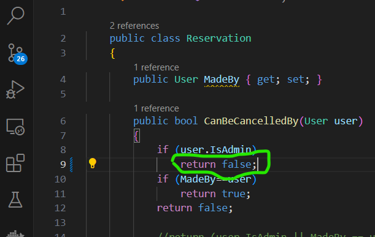

Comprobacion de la falla

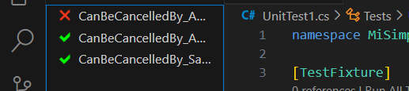

Refactorizacion del codigo

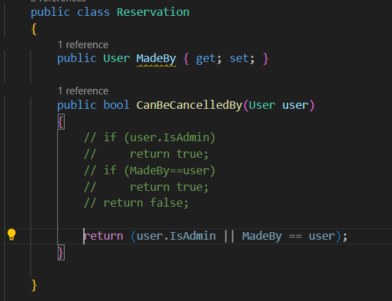

Dotnet test

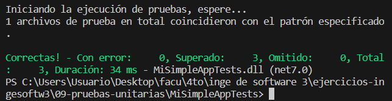

## Desarrollo de pruebas unitarias sobre una WebAPI

Creacion de proyecto de pruebas

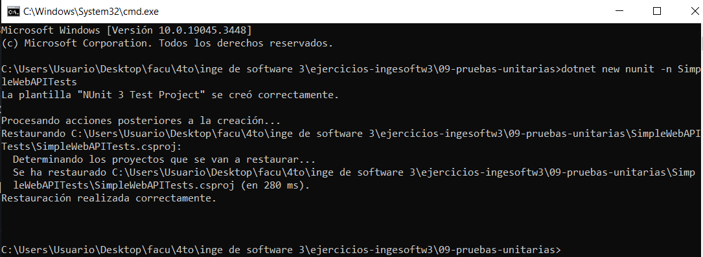

Add Reference

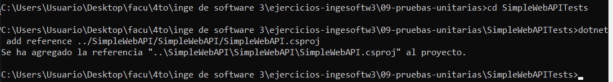

Edicion de settings.json

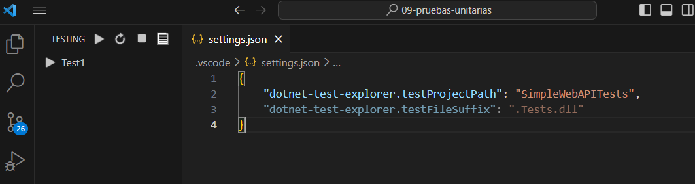

Reemplazo de UnitTest1.cs

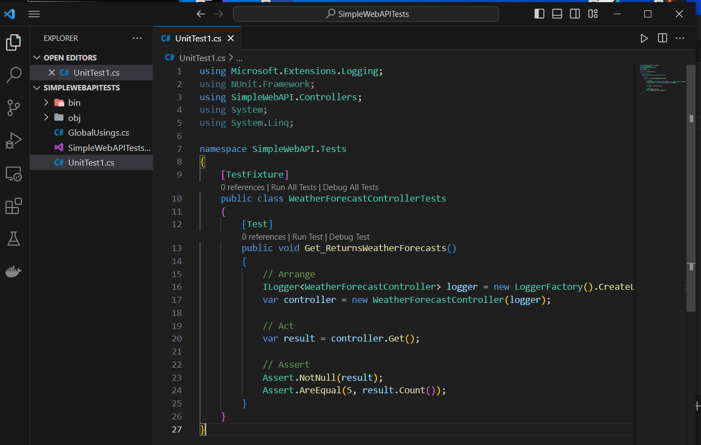

Resultados de los tests

## Tests con mocks

Resultados de los tests con mock

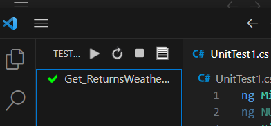

Por consola

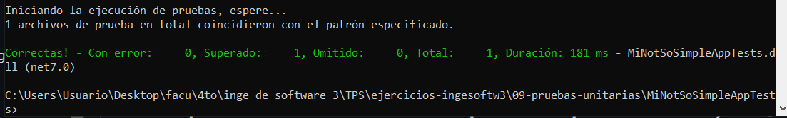

En el archivo de test se reemplaza el servicio real de HttpClient por el mock `mockHttpMessageHandler`. El cual da la posibilidad de probar la logica del servicio sin tener que hacer llamadas HTTP reales. Tambien se usa una respuesta HTTP mock con las lineas
`new HttpResponseMessage(HttpStatusCode.OK)
    {
        Content = new StringContent("[{ \"UserId\": 1, \"Id\": 1, \"Title\": \"Test Title\", \"Body\": \"Test Body\" }]")
    };`

Fallo en el test luego de modificar el codigo de estado de la respuesta a `NotFound`

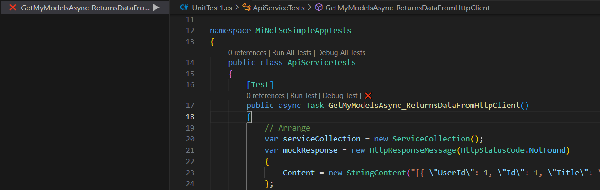

Nuevo test con el mock modificado 

`
[Test]
        public async Task GetMyModelsAsync_ReturnsExpectedNumberOfItems()
        {
            // Arrange
            var serviceCollection = new ServiceCollection();

            // Define a collection of Post objects with a different length
            var posts = new List<Post>
            {
                new Post { UserId = 1, Id = 1, Title = "Test Title 1", Body = "Test Body 1" },
                new Post { UserId = 2, Id = 2, Title = "Test Title 2", Body = "Test Body 2" },
            };

            var mockResponse = new HttpResponseMessage(HttpStatusCode.OK)
            {
                Content = new StringContent(JsonSerializer.Serialize(posts))
            };

            var mockHttpMessageHandler = new Mock<HttpMessageHandler>();
            mockHttpMessageHandler.Protected()
                .Setup<Task<HttpResponseMessage>>("SendAsync", ItExpr.IsAny<HttpRequestMessage>(), ItExpr.IsAny<CancellationToken>())
                .ReturnsAsync(mockResponse);

            serviceCollection.AddTransient<IApiService>(_ => new ApiService(new HttpClient(mockHttpMessageHandler.Object)));
            var serviceProvider = serviceCollection.BuildServiceProvider();

            var apiService = serviceProvider.GetRequiredService<IApiService>();

            // Act
            var result = await apiService.GetMyModelsAsync();

            // Assert
            Assert.IsNotNull(result);

            // Verify that the number of items returned matches the expected count
            Assert.AreEqual(2, result.Count());
        }
`
